# ValidAI Architecture

## Table of Contents

1. [System Overview](#system-overview)
2. [High-Level Architecture](#high-level-architecture)
3. [Data Flow](#data-flow)
4. [Module Architecture](#module-architecture)
5. [State Management](#state-management)
6. [Persistence Layer](#persistence-layer)
7. [Security Architecture](#security-architecture)
8. [UI Component Tree](#ui-component-tree)
9. [Analysis Pipeline](#analysis-pipeline)
10. [Score Calculation](#score-calculation)
11. [GitHub Integration Flow](#github-integration-flow)
12. [Export Pipeline](#export-pipeline)

---

## System Overview

ValidAI is a single-page application (SPA) built with React that runs entirely in the browser. There is no backend server — all analysis, storage, and encryption happen client-side.

```
┌─────────────────────────────────────────────────────────┐
│                      Browser                            │
│                                                         │
│  ┌──────────┐  ┌──────────┐  ┌────────────────────┐    │
│  │  React   │  │ Zustand  │  │    IndexedDB       │    │
│  │   UI     │◄─┤  Store   │◄─┤  (submissions,     │    │
│  │          │  │          │  │   findings,         │    │
│  └────┬─────┘  └────┬─────┘  │   settings)        │    │
│       │              │        └────────────────────┘    │
│       │              │                                  │
│  ┌────▼─────────────▼──────┐  ┌────────────────────┐   │
│  │   Analysis Engine       │  │  Web Crypto API    │   │
│  │   (10 modules)          │  │  (AES-256-GCM)     │   │
│  └─────────────────────────┘  └────────────────────┘   │
│                                                         │
│  ┌─────────────────────────┐  ┌────────────────────┐   │
│  │   GitHub API (fetch)    │  │  Claude API        │   │
│  │   (commits, PRs)        │  │  (AI Review)       │   │
│  └─────────────────────────┘  └────────────────────┘   │
└─────────────────────────────────────────────────────────┘
```

**Key Design Decisions:**
- No backend — zero deployment complexity, works offline after load
- IndexedDB — persists data across sessions without a server
- Web Crypto API — encrypts secrets before localStorage storage
- Zustand — lightweight state management (no Redux boilerplate)

---

## High-Level Architecture

```mermaid
graph TB
    subgraph UI["UI Layer (React)"]
        App[App.jsx]
        Dashboard[Dashboard]
        CodeSubmission[Code Submission]
        GitHubAnalysis[GitHub Analysis]
        AnalysisView[Analysis Results]
        TrendHistory[Trends & History]
        Settings[Settings]
    end

    subgraph Components["Shared Components"]
        CodeEditor[CodeEditor]
        ModuleSelector[ModuleSelector]
        FindingCard[FindingCard]
        QuickStats[QuickStats]
        TrendChart[TrendChart]
        ExportPanel[ExportPanel]
    end

    subgraph Engine["Analysis Engine"]
        AE[analysisEngine.js]
        FM[Failure Mode]
        SP[Security Probe]
        HD[Hallucination Detector]
        CP[Complexity Profiler]
        OC[Oracle Checker]
        MS[Mutation Scorer]
        PG[Property Generator]
        DR[Differential Runner]
        PT[Prompt Testability]
        AR[AI Review Assistant]
    end

    subgraph State["State & Persistence"]
        Store[Zustand Store]
        DB[(IndexedDB)]
        Crypto[Web Crypto API]
        LS[localStorage]
    end

    subgraph External["External APIs"]
        GitHub[GitHub REST API]
        Claude[Claude API]
    end

    App --> Dashboard & CodeSubmission & GitHubAnalysis & AnalysisView & TrendHistory & Settings
    CodeSubmission --> CodeEditor & ModuleSelector
    CodeSubmission --> AE
    GitHubAnalysis --> AE
    AnalysisView --> FindingCard & QuickStats & ExportPanel
    TrendHistory --> TrendChart

    AE --> FM & SP & HD & CP & OC & MS & PG & DR & PT & AR
    AR --> Claude

    CodeSubmission --> Store
    GitHubAnalysis --> Store & GitHub
    Store --> DB
    Settings --> Crypto --> LS
```

---

## Data Flow

### Code Submission Flow

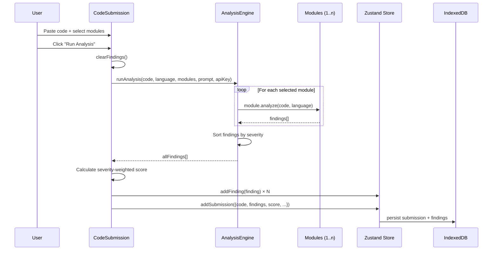

### GitHub Analysis Flow

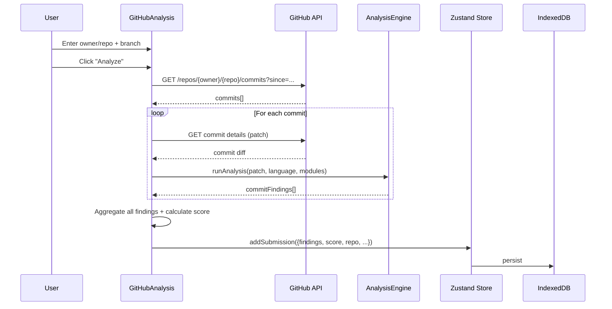

---

## Module Architecture

Each analysis module follows the same interface:

```javascript
// Module contract
(code: string, language: string) => Finding[]

// Finding structure
{
  id: string,           // Unique identifier
  module: string,       // Module key (e.g., 'failureMode')
  moduleName: string,   // Display name (e.g., 'Failure Mode Scanner')
  severity: string,     // 'Critical' | 'High' | 'Medium' | 'Info'
  category: string,     // Pattern name
  description: string,  // What the issue is
  lineNumber: number,   // Where in the code
  suggestion: string,   // How to fix it
  timestamp: string     // ISO 8601
}
```

### Module Registry

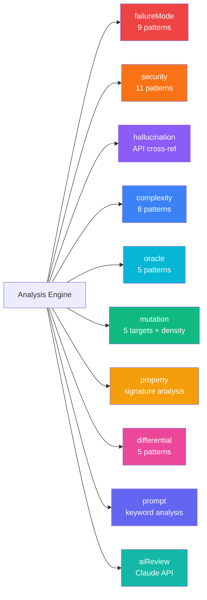

### Pattern Detection

Most modules use regex-based pattern matching:

```
Code Input
    │
    ▼
Split into lines
    │
    ▼
For each line:
    For each pattern:
        if regex.test(line):
            → Create Finding{severity, category, description, suggestion}
    │
    ▼
Return findings[]
```

The **AI Review Assistant** is the exception — it sends code to the Claude API for semantic analysis.

### Module Pattern Counts

| Module | Patterns | Detection Method |
|--------|----------|-----------------|
| Failure Mode Scanner | 9 | Regex per-line |
| Security Probe | 11 | Regex per-line |
| Hallucination Detector | ~150 known APIs | API cross-reference |
| Complexity Profiler | 8 | Regex per-line |
| Oracle Checker | 5 | Regex per-line |
| Mutation Scorer | 5 + density | Regex + statistics |
| Property Generator | 3 | Regex signature analysis |
| Differential Runner | 5 | Regex per-line |
| Prompt Testability | 5 | Keyword analysis |
| AI Review Assistant | Semantic | Claude API call |

---

## State Management

### Zustand Store Structure

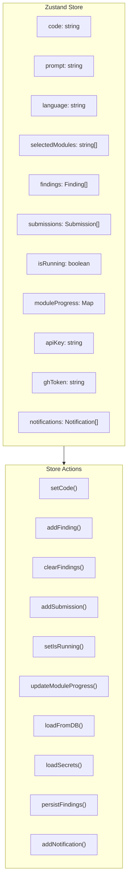

### State Flow

```
User Action → Store Action → State Update → React Re-render
                                  │
                                  └──→ IndexedDB Persist (async)
```

---

## Persistence Layer

### IndexedDB Schema

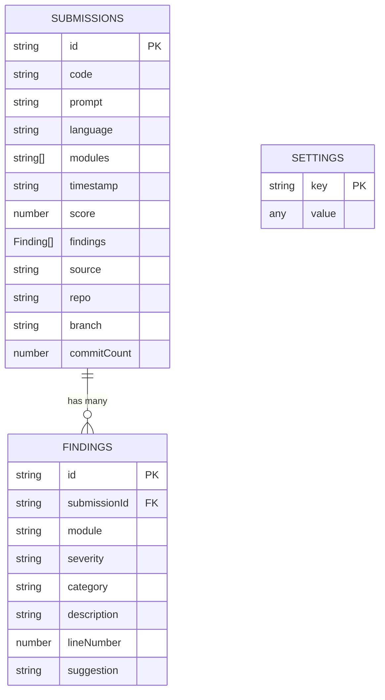

### Storage Architecture

```
┌─────────────────────────────────┐
│         IndexedDB               │
│  ┌───────────┐ ┌────────────┐  │
│  │submissions│ │  findings   │  │
│  │  store    │ │   store     │  │
│  └───────────┘ └────────────┘  │
│  ┌───────────┐                  │
│  │ settings  │                  │
│  │  store    │                  │
│  └───────────┘                  │
└─────────────────────────────────┘

┌─────────────────────────────────┐
│        localStorage             │
│  ┌─────────────────────────┐    │
│  │ encrypted_apiKey (AES)  │    │
│  │ encrypted_ghToken (AES) │    │
│  └─────────────────────────┘    │
└─────────────────────────────────┘
```

---

## Security Architecture

### Encryption Flow

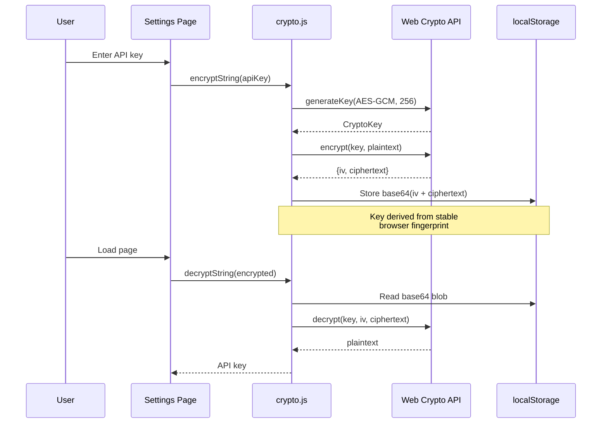

### Security Properties
- **AES-256-GCM** — Authenticated encryption with associated data
- **Random IV** — Each encryption uses a fresh initialization vector
- **No plaintext storage** — API keys never stored in cleartext
- **Client-side only** — Secrets never leave the browser

---

## UI Component Tree

```mermaid
graph TD
    App["App.jsx"]
    App --> Sidebar["Sidebar (Navigation)"]
    App --> Header["Header (Date)"]
    App --> Main["Main Content Area"]
    App --> Toasts["Toast Notifications"]

    Main --> Dashboard
    Main --> CodeSubmission
    Main --> GitHubAnalysis
    Main --> AnalysisView
    Main --> TrendHistory
    Main --> Settings

    Dashboard --> DashKPIs["KPI Cards"]
    Dashboard --> DashSeverity["Severity Breakdown"]
    Dashboard --> DashModules["Module Status"]
    Dashboard --> DashRecent["Recent Submissions"]

    CodeSubmission --> Banner1["Page Banner"]
    CodeSubmission --> CodeEditor
    CodeSubmission --> ModuleSelector
    CodeSubmission --> TestProfiles["Test Profiles"]
    CodeSubmission --> PromptInput["Prompt Input"]

    GitHubAnalysis --> Banner2["Page Banner"]
    GitHubAnalysis --> GHInput["GitHubCodeAnalysis"]
    GitHubAnalysis --> AnalysisDetails

    AnalysisView --> Banner3["Page Banner"]
    AnalysisView --> Dropdown["Analysis Selector"]
    AnalysisView --> QuickStats
    AnalysisView --> FindingCards["FindingCard × N"]
    AnalysisView --> ExportPanel

    TrendHistory --> Banner4["Page Banner"]
    TrendHistory --> TrendKPIs["6 KPI Cards"]
    TrendHistory --> AreaChart["Score/Findings Area Chart"]
    TrendHistory --> PieChart["Severity Pie Chart"]
    TrendHistory --> BarChart["Module Bar Chart"]
    TrendHistory --> TrendChart["Quality Trend Line"]
    TrendHistory --> SubmissionHistory["Submission Table"]
```

---

## Analysis Pipeline

### End-to-End Pipeline

```mermaid
graph LR
    Input["Code Input<br/>(paste/upload/GitHub)"]
    Lang["Language<br/>Detection"]
    Mods["Module<br/>Selection"]
    Engine["Analysis<br/>Engine"]
    Sort["Sort by<br/>Severity"]
    Score["Calculate<br/>Score"]
    Store["Persist to<br/>IndexedDB"]
    Display["Render<br/>Findings"]
    Export["Export<br/>(JSON/MD/SARIF)"]

    Input --> Lang --> Mods --> Engine --> Sort --> Score --> Store --> Display --> Export

    style Input fill:#3b82f6,color:#fff
    style Engine fill:#8b5cf6,color:#fff
    style Score fill:#f59e0b,color:#fff
    style Store fill:#10b981,color:#fff
    style Display fill:#ec4899,color:#fff
```

### Severity Sort Order

```
Critical (0) → High (1) → Medium (2) → Info (3)
```

Findings are always displayed most-severe-first.

---

## Score Calculation

### Formula

```
score = max(0, 100 - weighted_sum)

weighted_sum = (critical × 10) + (high × 5) + (medium × 2) + (info × 0.5)
```

### Impact Table

| Severity | Weight | Example: 5 findings | Score Impact |
|----------|--------|---------------------|-------------|
| Critical | 10 | 5 critical | -50 points |
| High | 5 | 5 high | -25 points |
| Medium | 2 | 5 medium | -10 points |
| Info | 0.5 | 5 info | -2.5 points |

### Score Ranges

```
100 ████████████████████ Excellent (no issues)
 80 ████████████████     Good (minor issues)
 60 ████████████         Fair (needs attention)
 40 ████████             Poor (significant issues)
 20 ████                 Critical (major rework)
  0 ▪                    Severe (many critical findings)
```

---

## GitHub Integration Flow

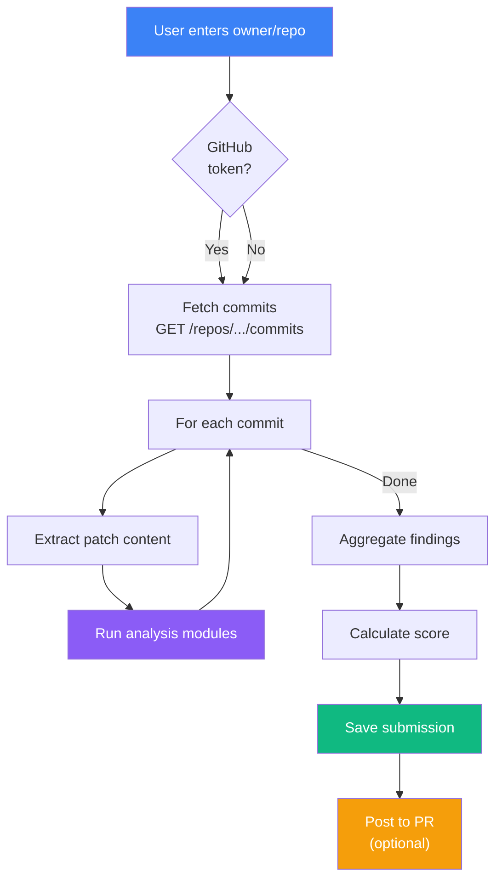

---

## Export Pipeline

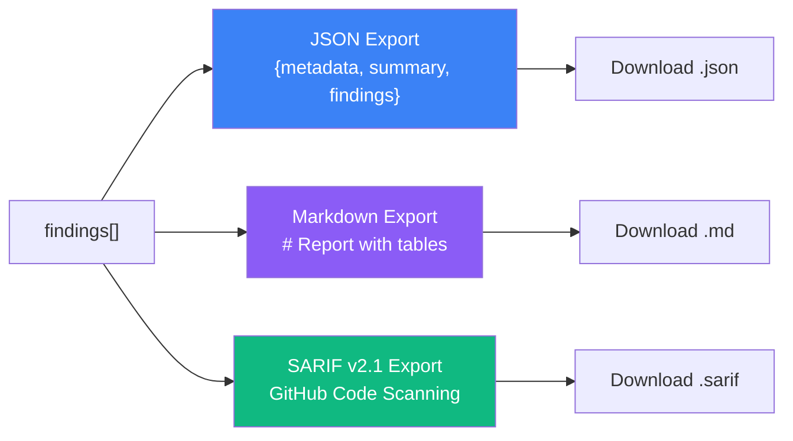

### SARIF Integration

```
ValidAI Export (.sarif)
       │
       ▼
GitHub Actions upload-sarif
       │
       ▼
GitHub Code Scanning Alerts
       │
       ▼
PR Annotations + Security Tab
```

---

## Technology Decisions

| Decision | Choice | Rationale |
|----------|--------|-----------|
| No backend | Client-only SPA | Zero ops, works offline, no server costs |
| IndexedDB | Over localStorage | Structured data, larger storage, async API |
| Zustand | Over Redux | Minimal boilerplate, no action creators/reducers |
| Vite | Over Webpack | Faster dev server, native ESM, simpler config |
| Regex patterns | Over AST parsing | Simpler, language-agnostic, fast execution |
| Web Crypto API | Over JS crypto libs | Native browser API, hardware-accelerated |
| Recharts | Over D3 | React-native, declarative, easier to maintain |
| CodeMirror 6 | Over Monaco | Lighter weight, better mobile support |
| Vitest | Over Jest | Native Vite integration, faster test execution |

---

## Performance Characteristics

| Operation | Typical Time | Notes |
|-----------|-------------|-------|
| Single module analysis | 2–5ms | Regex scan of code lines |
| Full Audit (9 modules) | 15–40ms | Excludes AI Review |
| AI Review Assistant | 5–15s | Claude API round-trip |
| IndexedDB write | 5–20ms | Single submission |
| Export generation | <5ms | JSON/MD/SARIF serialization |
| GitHub commit fetch | 1–3s | Network dependent |

All regex-based modules run synchronously in the browser's main thread. The AI Review Assistant is the only module that makes an external API call.
